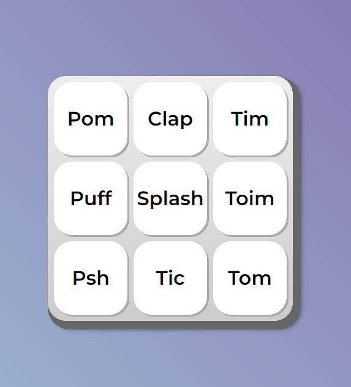

# MIDI JS

o MIDI é um instrumento musical de interface digitial (MIDI), que reproduz sons de instrumentos musicais, por enquanto de uma bateria, ao usuário clicar ou pressionar com teclado em seus botões.

## Interface do projeto

  

## Sumário

- [Tecnologias Utilizadas](#tecnologias-utilizadas)
- [Status](#status)
- [Descrição](#descrição)
- [Funcionalidades](#funcionalidades)
- [Autor](#autor)

## Tecnologias Utilizadas

  

    
  

  

    
  

  

    
  

## Status

<!-- -->

## Descrição

O MIDI tem um teclado digitial com 9 botões, cada botão reproduzirá o som de dado instrumento musical.

## Funcionalidades

O HTML carregará os arquivos de mídia com o som dos instrumentos através do elemento `<audio>`, e com o MIDI vamos controlar a reprodução destes arquivos de mídia através do clique em seus elementos `<button>`. Serão 9 sons diferentes.

## Autor

Desenvolvido por Diego Franco.
